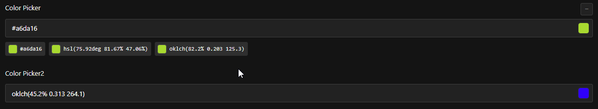

# PayloadCMS Color Picker Field

A custom color picker field plugin for PayloadCMS that supports multiple color formats (HEX, HSL, and OKLCH).



## Features

- 🎨 Support for multiple color formats:
  - HEX (`#RRGGBB`)
  - HSL (`hsl(h, s%, l%)`)
  - OKLCH (`oklch(l% c h)`)
  - All formats combined (stored as JSON)
- 🎯 Direct color input or color picker selection
- ✨ Real-time color preview
- 🔄 Format conversion on the fly
- 🎯 Validation for all color formats
- 💅 Styled to match PayloadCMS UI

## Installation

```bash
npm install payloadcms-color-picker-field
# or
yarn add payloadcms-color-picker-field
# or
pnpm add payloadcms-color-picker-field
```

## Usage

1. First, import the field in your PayloadCMS configuration:

```typescript
import { ColorPickerField } from 'payloadcms-color-picker-field'
```

2. Use it in your collection or global fields:

```typescript
import { CollectionConfig } from 'payload/types'

export const YourCollection: CollectionConfig = {
  slug: 'your-collection',
  fields: [
    ColorPickerField({
      name: 'backgroundColor',
      format: 'hex',
      required: true,
    }),
    // ... other fields
  ],
}
```

### Field Options

| Option        | Type                                 | Default      | Description                      |
| ------------- | ------------------------------------ | ------------ | -------------------------------- |
| `name`        | `string`                             | required     | The name of the field            |
| `label`       | `string`                             | `name` value | Label to display in the admin UI |
| `format`      | `'hex' \| 'hsl' \| 'oklch' \| 'all'` | `'hex'`      | The color format to use          |
| `required`    | `boolean`                            | `false`      | Whether the field is required    |
| `placeholder` | `string`                             | `'#000000'`  | Placeholder text for the input   |

### Format Types

- `hex`: Stores color as hexadecimal (e.g., `"#FF0000"`)
- `hsl`: Stores color as HSL (e.g., `"hsl(0, 100%, 50%)"`)
- `oklch`: Stores color as OKLCH (e.g., `"oklch(48.4% 0.184 27.7)"`)
- `all`: Stores all formats as JSON (e.g., `{"hex": "#FF0000", "hsl": "hsl(0, 100%, 50%)", "oklch": "oklch(48.4% 0.184 27.7)"}`)

### Examples

#### Basic Usage (HEX)

```typescript
ColorPickerField({
  name: 'textColor',
  format: 'hex',
  required: true,
})
```

#### HSL Color Field

```typescript
ColorPickerField({
  name: 'linkColor',
  format: 'hsl',
  label: 'Link Color',
})
```

#### All Formats (with JSON storage)

```typescript
ColorPickerField({
  name: 'brandColor',
  format: 'all',
  label: 'Brand Color',
  required: true,
})
```

## Development

### Building the Plugin

1. Clone the repository:

```bash
git clone https://github.com/lionel-dutrieux/payloadcms-color-picker-field.git
cd payloadcms-color-picker-field
```

2. Install dependencies:

```bash
npm install
# or
yarn
# or
pnpm install
```

3. Build the plugin:

```bash
npm run build
# or
yarn build
# or
pnpm build
```

### Testing

```bash
npm run test
# or
yarn test
# or
pnpm test
```

## Contributing

Contributions are welcome! Please feel free to submit a Pull Request.

## License

MIT License - see the [LICENSE](LICENSE) file for details.
